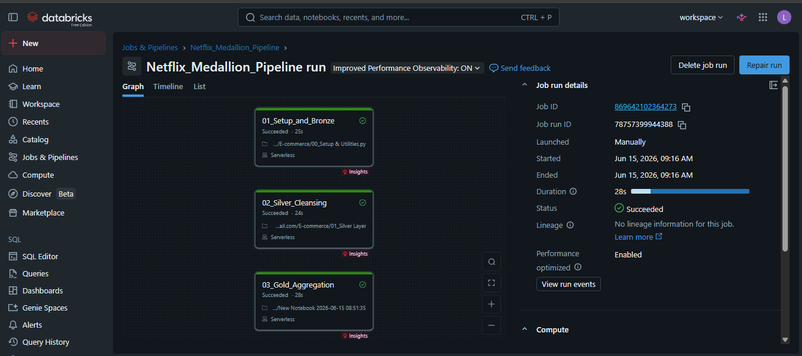

# 🍿 Netflix Data Pipeline: End-to-End Medallion Architecture

## 📌 Project Overview
This project demonstrates a complete **Data Engineering pipeline** using the Medallion Architecture (Lakehouse) inside **Databricks**. It processes raw Netflix catalog data, cleanses it, and aggregates business KPIs for an Executive Dashboard in **Power BI**.

## 🏗️ Architecture & Technologies
* **Platform:** Databricks (Compute & Workflows)
* **Data Governance:** Unity Catalog
* **Storage:** Delta Lake
* **Language:** PySpark (Python) & Spark SQL
* **Orchestration:** Databricks Jobs (LakeFlow)
* **Data Visualization:** Power BI Desktop (Direct connection via JDBC)

## 🔄 Pipeline Layers (Automated Workflows)
The pipeline is fully orchestrated using Databricks Jobs with strict dependencies (Bronze -> Silver -> Gold):

1. **🥉 Bronze Layer (`01_Bronze.ipynb`)**
   * Ingests raw CSV data from a Databricks Volume.
   * Preserves the raw state while appending technical metadata (`ingestion_date`, `source_system`).
   * Implements a custom Python logging function to track execution success/failure in an Audit table.

2. **🥈 Silver Layer (`02_Silver.ipynb`)**
   * Reads from Bronze and enforces strict Data Quality rules.
   * Deduplicates records (`dropDuplicates`) and handles missing values (`fillna`).
   * Performs intelligent type casting using Regular Expressions (`regexp_extract`) and Date formatting.

3. **🥇 Gold Layer (`03_Gold.ipynb`)**
   * Applies advanced PySpark transformations. Uses `explode` and `split` array functions to unnest comma-separated genre strings.
   * Aggregates the clean data into three distinct Business Data Marts optimized for BI consumption.

## 📊 Business Intelligence Dashboard
The Gold layer tables are connected to Power BI Desktop. The dashboard was designed focusing on UI/UX best practices, utilizing a dark theme to match the Netflix branding.

<video src="E-commerce.mp4" controls="controls" width="100%"></video>

## 💡 Key Learnings
* Building resilient PySpark code with `try-except` blocks.
* Managing state and dependencies in Databricks Clusters.
* Resolving Unity Catalog pathing and file system (`dbutils.fs`) references.
